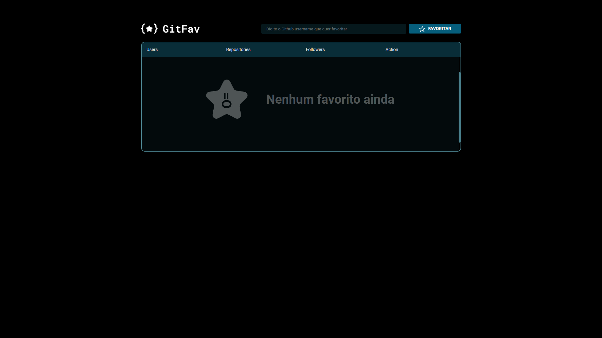
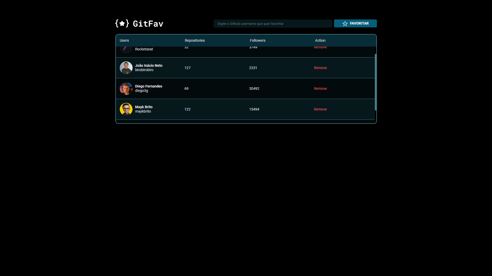

# Português
Projeto feito como desafio durante o stage 06 do Explorer(FullStack) da Rocketseat.

Foi utilizado:
  - HTML;
  - CSS;
  - JS;

Utilizei conceitos de classes no JavaScript para criar a lógica dos dados e para criar a vizualização dos eventos e do HTML.
Fizemos uma conexão com uma API do github para buscar os usuários e adicionar nos favoritos.

------------------------------------------------------------------------------------------------------------------------------------
# English
Project done as a challenge during stage 06 of Rocketseat's Explorer (FullStack).

Was used:
  - HTML;
  - CSS;
  - JS;

I used class concepts in JavaScript to create the data logic and to create the visualization of events and HTML.
We made a connection to a github API to search for users and add them to favorites.

# Layout 

